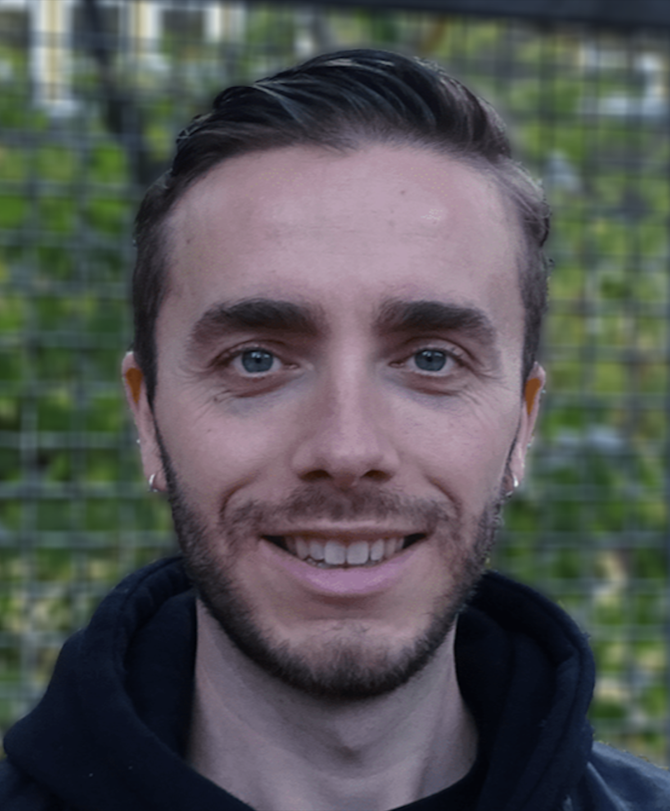

## About Me

My name is Bas, I have 5+ years of working experience as a studio representative & personal trainer and 2+ years as a Fullstack Developer. Since 2020 I am working as a Sales and Marketing coordinator.
Different interests make a diverse CV. Where it all comes together? Communication. I listen actively, analyze and get the job done. I am pro-active, reliable, have an acute attention to detail, and problem-solving with a user-centered focus.

## Occupation

`2021 - Now`
**Junior web developerr**, _Fizor_, Utrecht

- _Git expert_
- _Has a digital CV_

## Education

`2021`
**Qien**
**Fizor**

`2020 - 2021`
**Ironhack**

`2018 - 2020`
**Codecademy**

## Skills

| Technical    | Soft         |
| ------------ | ------------ |
| Git          | Cool         |
| Github       | Listening    |
| HTML         | Adaptable    |
| CSS          | Persistent   |
| Javascript   | Empathy      |
| MongoDB      | Communiation |
| Express      |              |
| Node.js      |              |
| React.js     |              |
| Scrum Master |              |
| Low-code     |              |

## Certification

`2020`
**Ironhack**

## Languages

- Dutch (Native)

- English (C2)
